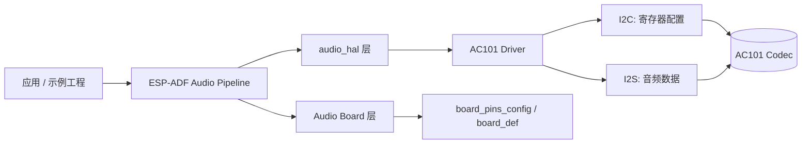
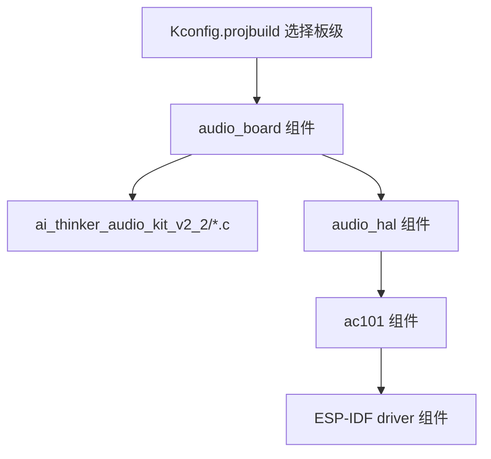

# ESP32-A1S 在 2026年 最新 ESP-ADF 的兼容升级详细文档
- 作者：LMINYO  
- 创建日期：2026-02-02  
- 文档版本：v1.0.0  
- 适配目标：ESP-IDF 5.5.2 / 5.3.4 + 最新 ESP-ADF（组件式构建 / idf_component_register）  
  
## 更新记录

| 版本 | 日期 | 变更摘要 | 负责人 |
|:--|:--|:--|:--|
| v1.0.0 | 2026-02-02 | 形成 AC101 适配体系、文件差异说明、迁移清单、示例与排障 | LMINYO |

---

## 目录（TOC）


- [1. 引言](#1-引言)
  - [1.1 背景](#11-背景)
  - [1.2 目标](#12-目标)
  - [1.3 适用范围](#13-适用范围)
  - [1.4 术语表](#14-术语表)
- [2. 交付物与代码位置](#2-交付物与代码位置)
  - [2.1 交付物清单](#21-交付物清单)
  - [2.2 关键代码路径（本仓库）](#22-关键代码路径本仓库)
  - [2.3 关键代码路径（历史源文件）](#23-关键代码路径历史源文件)
- [3. 总体架构与数据流](#3-总体架构与数据流)
  - [3.1 架构概述](#31-架构概述)
  - [3.2 Mermaid 架构图](#32-mermaid-架构图)
  - [3.3 关键注意事项](#33-关键注意事项)
- [4. 文件差异与升级点总览（AC101 与板级）](#4-文件差异与升级点总览ac101-与板级)
  - [4.1 AC101 驱动差异](#41-ac101-驱动差异)
  - [4.2 Ai-Thinker V2.2 板级差异](#42-ai-thinker-v22-板级差异)
  - [4.3 构建系统差异（CMake / component.mk / Kconfig）](#43-构建系统差异cmake--componentmk--kconfig)
- [5. ESP-IDF 5.5.2 / 5.3.4 兼容要点（必改清单）](#5-esp-idf-552--534-兼容要点必改清单)
  - [5.1 FreeRTOS Tick 宏替换](#51-freertos-tick-宏替换)
  - [5.2 GPIO 选择器宏与 64 位位图](#52-gpio-选择器宏与-64-位位图)
  - [5.3 I2S 引脚结构升级：board_i2s_pin_t](#53-i2s-引脚结构升级board_i2s_pin_t)
- [6. 迁移与集成步骤（从零到可编译可运行）](#6-迁移与集成步骤从零到可编译可运行)
  - [6.1 环境准备与路径变量](#61-环境准备与路径变量)
  - [6.2 选择开发板与菜单配置](#62-选择开发板与菜单配置)
  - [6.3 编译、烧录、监视器](#63-编译烧录监视器)
- [7. 可复制运行的示例代码](#7-可复制运行的示例代码)
  - [7.1 最小化 I2C 探测（确认 AC101 在线）](#71-最小化-i2c-探测确认-ac101-在线)
  - [7.2 最小化音频板初始化与 Codec 启动](#72-最小化音频板初始化与-codec-启动)
  - [7.3 常用验证清单（播放/录音/音量/静音）](#73-常用验证清单播放录音音量静音)
- [8. 常见问题与排障（FAQ + 诊断流程）](#8-常见问题与排障faq--诊断流程)
  - [8.1 FAQ](#81-faq)
  - [8.2 排障步骤（建议按顺序执行）](#82-排障步骤建议按顺序执行)
  - [8.3 典型日志与对应处理](#83-典型日志与对应处理)
- [9. ES8388 参考说明（自修复建议）](#9-es8388-参考说明自修复建议)
  - [9.1 概述](#91-概述)
  - [9.2 常见差异点与自修复方向](#92-常见差异点与自修复方向)
- [10. 附录](#10-附录)
  - [10.1 资源下载地址](#101-资源下载地址)
  - [10.2 参考链接](#102-参考链接)
  - [10.3 变更对照表（速查）](#103-变更对照表速查)
  
---

## 1. 引言
由于安信可官方没有对 ESP32-A1S 最新版 ESP-ADF 进行适配，导致在 ESP-IDF 5.5.2 / 5.3.4 下编译报错或运行异常。说明国内开发社区对 ESP32-A1S 的支持仍旧存在一定的滞后性。基本就是发布即不管的状态，很考验开发者的耐心和错误分析能力，我查找了很多文档，只有寥寥两三个有具体解决方案，但是也是基于旧版 ESP-ADF 进行的移植，很多差异点都没有提及。这个最新版本希望能够对大家有所帮助，减少踩坑，迅速上手开发学习
建议操作前查看安信可官方的仓库教程，了解如何将 ESP32-A1S-AIThinker的库 放入最新版 ESP-ADF 进行适配操作，尤其注意目录关系，驱动和板级目录是放在不同的子目录下的，需要注意路径关系。
如果有帮助的话欢迎给项目点个小小的Star，谢谢！

### 1.1 背景


ESP32-A1S（Ai-Thinker Audio Kit）历史上常见两种 Codec 硬件组合：ES8388 与 AC101。随着 ESP-IDF 迭代到 5.x，组件构建、FreeRTOS 宏、GPIO 位图宏等接口发生变化，导致早期移植版本在 ESP-IDF 5.5.2 / 5.3.4 下出现编译报错或运行异常（典型表现为 I2C 初始化失败、Tick 宏未定义、触摸按键位图宏不匹配、I2S 引脚结构不兼容等）。

本文档基于 2026 年最新完善版代码，对以下两处安信可官方来源进行对比梳理并给出可复用升级方案：  

- ESP-ADF 中 AC101 驱动目录
- ESP-ADF 中 Ai-Thinker V2.2 板级目录


同时，官方/社区教程中关于 ESP32-A1S 的接线与板级接入说明可以作为背景参考，但本文档不直接复制任何第三方原文内容，而是以“可落地的迁移清单 + 可运行示例 + 排障流程”的方式重新组织输出，方便你写入自己的教程文档与内部规范。

### 1.2 目标

- 让 AC101 在 ESP-IDF 5.5.2 / 5.3.4 + 最新 ESP-ADF 下稳定编译、烧录、运行。  
- 给出“新版 SDK 兼容改造”的结构化差异说明，帮助你从旧工程快速升级。  
- 给出可直接复制运行的最小示例，用于验证 I2C、Codec、I2S 关键链路。  
- 给出排障 SOP（Standard Operating Procedure），降低现场定位成本。  
  
### 1.3 适用范围

- 硬件：ESP32-A1S / Ai-Thinker Audio Kit V2.2（AC101 版本）。  
- 软件：ESP-IDF 5.5.2 或 5.3.4；ESP-ADF（以本地工程为准）。  
- 构建系统：CMake（idf_component_register），可兼容 legacy 的 component.mk 选择逻辑。  
  

不适用场景：  

- 非 ESP32 芯片（例如 ESP32-S3/ESP32-C3 等）使用 AC101 的场景，需要按芯片外设差异复核 I2S/I2C 引脚与时钟。  
- 你希望在无 ESP-ADF 的纯 ESP-IDF 工程中集成完整 Audio Pipeline，此时建议参考 ADF 的 audio_hal 抽象与外围依赖裁剪方案。  
  
### 1.4 术语表

| 术语 | 英文 | 说明 |
|:--|:--|:--|
| ESP-IDF | Espressif IoT Development Framework | 乐鑫官方 SDK（本文以 5.5.2 / 5.3.4 为目标） |
| ESP-ADF | Espressif Audio Development Framework | 乐鑫音频框架，提供 audio_pipeline、audio_hal、board 支持等 |
| Codec | Audio Codec | 音频编解码芯片（本文聚焦 AC101，另提供 ES8388 参考） |
| HAL | Hardware Abstraction Layer | 硬件抽象层；本文涉及 audio_hal 与 driver 层 |
| I2C | Inter-Integrated Circuit | 控制总线，AC101 寄存器通过 I2C 配置 |
| I2S | Inter-IC Sound | 音频数据总线，PCM 数据通过 I2S 传输 |
| MCLK | Master Clock | I2S 主时钟（部分方案需要），本文板级引脚结构已预留 |
| GFM | GitHub Flavored Markdown | GitHub 风格 Markdown，支持 Mermaid、任务列表、表格等 |

---

## 2. 交付物与代码位置

### 2.1 交付物清单

- AC101 驱动与板级适配代码（已存在于工程）：  
  - [ac101.c](file:///e:/espadf/esp-adf/components/audio_hal/driver/ac101/ac101.c)  
  - [ac101.h](file:///e:/espadf/esp-adf/components/audio_hal/driver/ac101/ac101.h)  
  - [board.c](file:///e:/espadf/esp-adf/components/audio_board/ai_thinker_audio_kit_v2_2/board.c)  
  - [board_def.h](file:///e:/espadf/esp-adf/components/audio_board/ai_thinker_audio_kit_v2_2/board_def.h)  
  - [board_pins_config.c](file:///e:/espadf/esp-adf/components/audio_board/ai_thinker_audio_kit_v2_2/board_pins_config.c)  
  
### 2.2 关键代码路径（本仓库）

- AC101 驱动目录：[ac101](file:///e:/espadf/esp-adf/components/audio_hal/driver/ac101)  
- Ai-Thinker V2.2 板级目录：[ai_thinker_audio_kit_v2_2](file:///e:/espadf/esp-adf/components/audio_board/ai_thinker_audio_kit_v2_2)  
- 板级引脚结构定义（重要）：[board_pins_config.h](file:///e:/espadf/esp-adf/components/audio_board/include/board_pins_config.h)  
- Kconfig 选择项（重要）：[Kconfig.projbuild](file:///e:/espadf/esp-adf/components/audio_board/Kconfig.projbuild)  
- legacy make 支持（如仍使用）：[component.mk](file:///e:/espadf/esp-adf/components/audio_board/component.mk)  
  
### 2.3 关键代码路径（历史源文件）

这些文件通常是早期移植或备份版本，作为对照参考：  

- `ac101\ac101.c`  
- `ac101\ac101.h`  
- `ai_thinker_audio_kit_v2_2\board.c`  
- `ai_thinker_audio_kit_v2_2\board_def.h`  
- `ai_thinker_audio_kit_v2_2\board_pins_config.c`  
  
---

## 3. 总体架构与数据流

### 3.1 架构概述

在 ESP-ADF 的典型使用方式中：  

- board 层负责“这块板子有哪些外设、各自用哪些 GPIO”，并提供统一初始化入口。  
- audio_hal 层负责抽象 Codec 的统一接口（初始化、启停、音量、静音、I2S 配置等）。  
- Codec driver 层（AC101）负责寄存器级配置，最终通过 I2C 写寄存器、通过 I2S 传输音频流。  
  

这三个层次的边界清晰之后，升级就可以拆解为两类工作：  

1) 适配 ESP-IDF 5.x 的 API 变化（Tick 宏、GPIO 位图宏、驱动头文件依赖等）。  
2) 适配 ESP-ADF 的结构变化（板级引脚结构、组件注册方式、Kconfig 选择项）。  

### 3.2 Mermaid 架构图



### 3.3 关键注意事项

- AC101 是否能工作，第一优先级是 I2C 通路是否稳定：上拉、电平、地址、时序。  
- I2S 音频不出声，常见原因是 I2S 引脚顺序与板级定义不一致，或者 PA 使能脚未拉起。  
- ESP-IDF 5.x 的宏与驱动 API 变更，最容易导致“能编译但运行异常”的情况（例如延时宏或位图宏不正确）。  
  

参考链接：  

- ESP-ADF（官方仓库）：https://github.com/espressif/esp-adf  
- ESP-IDF 编程指南（稳定入口）：https://docs.espressif.com/projects/esp-idf/en/stable/esp32/  
  
---

## 4. 文件差异与升级点总览（AC101 与板级）

本章每节均包含：概述、详细说明、示例、注意事项、参考链接，便于直接搬运到你的内部教程体系中。

### 4.1 AC101 驱动差异

#### 概述

历史版 AC101 驱动常见问题是：  

- FreeRTOS Tick 相关宏使用旧写法（`portTICK_RATE_MS`），在 ESP-IDF 5.x 下会报错或行为异常。  
- 部分驱动包含的头文件与依赖在 5.x 下需要调整（例如 I2S、GPIO 头文件、板级头文件引用路径）。  
  

当前工程的 AC101 驱动位于：[ac101.c](file:///e:/espadf/esp-adf/components/audio_hal/driver/ac101/ac101.c) 与 [ac101.h](file:///e:/espadf/esp-adf/components/audio_hal/driver/ac101/ac101.h)。

#### 详细说明

1) Tick 宏升级  

- 旧：`portTICK_RATE_MS`  
- 新：`portTICK_PERIOD_MS`  
  

该改动既影响 I2C 超时，也影响初始化阶段的延时稳定性。当前工程中 AC101 已统一使用 `portTICK_PERIOD_MS`（可在 [ac101.c](file:///e:/espadf/esp-adf/components/audio_hal/driver/ac101/ac101.c) 中检索确认）。

2) 组件依赖更清晰  

AC101 驱动组件注册（CMake）位于：[CMakeLists.txt](file:///e:/espadf/esp-adf/components/audio_hal/driver/ac101/CMakeLists.txt)  

- SRCS：`ac101.c`  
- INCLUDE_DIRS：`.`  
- REQUIRES：`audio_hal`、`driver`、`esp_common`  
  

这意味着驱动可以被更干净地复用到不同工程，而不会隐式依赖 board 层过多符号。

#### 图表/代码示例

Tick 宏替换示例（原则性展示）：  

```c
#include "freertos/FreeRTOS.h"
#include "freertos/task.h"

static void delay_ms(uint32_t ms)
{
    vTaskDelay(ms / portTICK_PERIOD_MS);
}
```

#### 注意事项

- 不要在驱动里硬编码 I2C 引脚，优先从 board 层获取（本工程使用 `get_i2c_pins(I2C_NUM_0, ...)`）。  
- 若你把驱动迁移到“非 ADF 工程”，需要额外提供 `get_i2c_pins()` 或自行实现 I2C 初始化逻辑。  
  
#### 参考链接

- ESP-IDF FreeRTOS 相关说明（入口）：https://docs.espressif.com/projects/esp-idf/en/stable/esp32/api-reference/system/freertos.html  
  
### 4.2 Ai-Thinker V2.2 板级差异

#### 概述

板级层的“升级点”主要集中在两件事：  

- GPIO 位图宏从旧式 `GPIO_SEL_x` 向 64 位位图表达迁移。  
- I2S 引脚配置从 `i2s_pin_config_t` 迁移到 ADF 自定义的 `board_i2s_pin_t`，以覆盖 MCLK 等字段。  
  
#### 详细说明

1) I2S 引脚结构升级  

在历史文件中，`get_i2s_pins()` 的入参可能是 `i2s_pin_config_t *`；在本工程中，板级头文件定义了 `board_i2s_pin_t`（见 [board_pins_config.h](file:///e:/espadf/esp-adf/components/audio_board/include/board_pins_config.h)），并在板级实现中填充 `mck_io_num` 等字段（见 [board_pins_config.c](file:///e:/espadf/esp-adf/components/audio_board/ai_thinker_audio_kit_v2_2/board_pins_config.c)）。

2) SD 卡与触摸按键位图宏升级  

历史版本常见写法：`GPIO_SEL_34`、`GPIO_SEL_19` 等；新版推荐使用位移表达，例如：`(1ULL << GPIO_NUM_34)`。  

在本工程中，可对照 [board_def.h](file:///e:/espadf/esp-adf/components/audio_board/ai_thinker_audio_kit_v2_2/board_def.h) 查看：  

- `SD_CARD_INTR_SEL (1ULL << GPIO_NUM_34)`  
- `TOUCH_SEL_SET (1ULL << GPIO_NUM_19)` 等  
  
#### 图表/代码示例

板级 I2S 引脚配置示例（展示结构变化的本质）：  

```c
#include "board_pins_config.h"

esp_err_t get_i2s_pins(int port, board_i2s_pin_t *i2s_config)
{
    if (port != 0) {
        return ESP_FAIL;
    }
    i2s_config->bck_io_num = 27;
    i2s_config->ws_io_num = 26;
    i2s_config->data_out_num = 25;
    i2s_config->data_in_num = 35;
    i2s_config->mck_io_num = 0;
    return ESP_OK;
}
```

#### 注意事项

- 部分 A1S 板卡批次存在丝印与实际引脚差异，升级时要以原理图或实测为准。  
- MCLK 是否必须取决于你的 I2S 配置与 Codec 时钟方案；即便不需要，也建议保持字段完整填充，以减少未来扩展成本。  
  
#### 参考链接

- ESP-ADF Board 体系概览（仓库入口）：https://github.com/espressif/esp-adf  
  
### 4.3 构建系统差异（CMake / component.mk / Kconfig）

#### 概述

新版 ESP-IDF 强调 CMake 组件化构建；ESP-ADF 同时保留部分 legacy make 选择逻辑（`component.mk`），以及通过 `Kconfig.projbuild` 提供 menuconfig 选项。

#### 详细说明

1) Kconfig 提供板级选择项  

在本工程中，Ai-Thinker V2.2 已加入 `Audio board` 的 choice 中（见 [Kconfig.projbuild](file:///e:/espadf/esp-adf/components/audio_board/Kconfig.projbuild)），默认项为 `ESP_AI_THINKER_V2_2_BOARD`。

2) legacy make 兼容  

如果你仍使用 component.mk 路径选择，本工程也已包含 `CONFIG_ESP_AI_THINKER_V2_2_BOARD` 条件编译（见 [component.mk](file:///e:/espadf/esp-adf/components/audio_board/component.mk)）。

3) CMake 组件注册  

板级目录本身有独立组件注册文件（见 [CMakeLists.txt](file:///e:/espadf/esp-adf/components/audio_board/ai_thinker_audio_kit_v2_2/CMakeLists.txt)），确保在组件依赖链中能正确拉起 `audio_board`、`audio_hal`、`driver` 等依赖。

#### 图表/代码示例

构建系统依赖关系示意：  



#### 注意事项

- 同时维护 CMake 与 component.mk 时，确保两者的“板级目录”路径一致，避免出现“menuconfig 选了但代码没编译进来”的假象。  
- Kconfig 的默认项会影响初学者体验；本文档以“默认选中 Ai-Thinker V2.2”为推荐配置。  
  
#### 参考链接

- ESP-IDF 构建系统（CMake）入口：https://docs.espressif.com/projects/esp-idf/en/stable/esp32/api-guides/build-system.html  
  
---

## 5. ESP-IDF 5.5.2 / 5.3.4 兼容要点（必改清单）

### 5.1 FreeRTOS Tick 宏替换

#### 概述

ESP-IDF 5.x 中常见的兼容改动之一，是将一些旧宏或旧行为统一到更明确的写法。对音频驱动而言，最常见的问题就是 `portTICK_RATE_MS`。

#### 详细说明

- 若你从旧工程复制驱动代码，请全局替换：  
  - `portTICK_RATE_MS` → `portTICK_PERIOD_MS`  
  

在 AC101 驱动中，该宏影响：  

- I2C 事务超时（`i2c_master_cmd_begin` 的 timeout 参数）  
- 初始化延时（`vTaskDelay`）  
  
#### 图表/代码示例

可直接复制的替换模板：  

```c
uint32_t timeout_ms = 1000;
TickType_t timeout_ticks = timeout_ms / portTICK_PERIOD_MS;
esp_err_t ret = i2c_master_cmd_begin(I2C_NUM_0, cmd, timeout_ticks);
```

#### 注意事项

- `timeout_ms / portTICK_PERIOD_MS` 在 tick 较大时可能变为 0，建议为关键路径做最小 tick 保护（例如 `timeout_ticks = MAX(timeout_ticks, 1)`），以避免极端配置导致超时立即返回。  
  
#### 参考链接

- FreeRTOS Tick 与延时 API（入口）：https://docs.espressif.com/projects/esp-idf/en/stable/esp32/api-reference/system/freertos.html  
  
### 5.2 GPIO 选择器宏与 64 位位图

#### 概述

GPIO “选择器宏”在旧代码中常以 `GPIO_SEL_19` 之类的方式出现。ESP-IDF 5.x 更鼓励使用显式的位移方式，尤其是在需要 64 位掩码的外设配置中（例如触摸按键、GPIO 中断选择等）。

#### 详细说明

将以下写法视为迁移目标：  

- 旧：`GPIO_SEL_34`  
- 新：`(1ULL << GPIO_NUM_34)`  
  

本工程的 Ai-Thinker V2.2 已完成此类替换（见 [board_def.h](file:///e:/espadf/esp-adf/components/audio_board/ai_thinker_audio_kit_v2_2/board_def.h)）。

#### 图表/代码示例

```c
#include "driver/gpio.h"

uint64_t intr_mask = (1ULL << GPIO_NUM_34);
```

#### 注意事项

- 请使用 `1ULL`，避免 32 位整型在高位 GPIO 上溢出。  
  
#### 参考链接

- ESP-IDF GPIO API（入口）：https://docs.espressif.com/projects/esp-idf/en/stable/esp32/api-reference/peripherals/gpio.html  
  
### 5.3 I2S 引脚结构升级：board_i2s_pin_t

#### 概述

ESP-ADF 将“板级 I2S 引脚”抽象为 `board_i2s_pin_t`，以统一表达 MCLK、BCK、WS、DIN、DOUT。这个变更能减少不同板卡在 I2S 初始化时对 ESP-IDF 原生结构的耦合。

#### 详细说明

定义位置：  

- [board_pins_config.h](file:///e:/espadf/esp-adf/components/audio_board/include/board_pins_config.h)  
  

板级实现位置：  

- [board_pins_config.c](file:///e:/espadf/esp-adf/components/audio_board/ai_thinker_audio_kit_v2_2/board_pins_config.c)  
  
#### 图表/代码示例

```c
typedef struct {
    int mck_io_num;
    int bck_io_num;
    int ws_io_num;
    int data_out_num;
    int data_in_num;
} board_i2s_pin_t;
```

#### 注意事项

- 若你在应用层仍直接调用 ESP-IDF 的 `i2s_set_pin`，请确保字段映射一致，尤其是 `ws_io_num` 与 `bck_io_num` 的物理连接不要弄反。  
  
#### 参考链接

- ESP-IDF I2S API（入口）：https://docs.espressif.com/projects/esp-idf/en/stable/esp32/api-reference/peripherals/i2s.html  
  
---

## 6. 迁移与集成步骤（从零到可编译可运行）

### 6.1 环境准备与路径变量

#### 概述

ESP-ADF 编译依赖 `ADF_PATH`。同时你需要确保 ESP-IDF 工具链环境已导入当前终端会话。

#### 详细说明

在 Windows PowerShell 中，建议使用 ESP-IDF 自带的导出脚本：  

```powershell
.$HOME/esp/esp-idf/export.ps1
```

然后设置 ADF_PATH（示例路径请按你的实际安装路径调整）：  

```powershell
$env:ADF_PATH="$HOME\esp\esp-adf"
echo $env:ADF_PATH
```

#### 注意事项

- 每次打开新终端需要重新导入环境，否则会出现 Python、CMake、Ninja 或工具链找不到的错误。  
  
#### 参考链接

- ESP-IDF 快速入门（入口）：https://docs.espressif.com/projects/esp-idf/en/stable/esp32/get-started/  
  
### 6.2 选择开发板与菜单配置

#### 概述

本工程通过 menuconfig 选择音频板卡。对 AC101 版本的 A1S，建议选择 `ESP32-AiThinker-audio V2.2`。

#### 详细说明

进入菜单配置：  

```bash
idf.py menuconfig
```

选择路径：  

`Audio HAL` → `Audio board` → `ESP32-AiThinker-audio V2.2`  

对应的 Kconfig 项可在 [Kconfig.projbuild](file:///e:/espadf/esp-adf/components/audio_board/Kconfig.projbuild) 中查看：`ESP_AI_THINKER_V2_2_BOARD`。

#### 注意事项

- 若你同时集成多块板卡，请明确默认项，避免团队成员首次构建选错板。  
  
#### 参考链接

- ESP-IDF menuconfig 使用说明（入口）：https://docs.espressif.com/projects/esp-idf/en/stable/esp32/api-guides/kconfig.html  
  
### 6.3 编译、烧录、监视器

#### 概述

完成环境导入与板卡选择后，执行标准三连：build、flash、monitor。

#### 详细说明

```bash
idf.py set-target esp32
idf.py build
idf.py -p COMx flash monitor
```

将 `COMx` 替换为你的串口号，例如 `COM5`。  

#### 注意事项

- 若遇到串口占用，请先关闭其它串口工具或重启监视器。  
  
#### 参考链接

- idf.py 命令说明（入口）：https://docs.espressif.com/projects/esp-idf/en/stable/esp32/api-guides/build-system.html  
  
---

## 7. 可复制运行的示例代码

> 说明：以下示例面向 ESP-IDF 5.5.2 / 5.3.4 + ESP-ADF 环境，假设你已经在工程中选择了 Ai-Thinker V2.2 板级，并且能正常包含 `board.h`、`audio_hal.h` 等头文件。

### 7.1 最小化 I2C 探测（确认 AC101 在线）

#### 概述

先确认 I2C 在线，再谈音频。I2C 不通时，所有 Codec 初始化与音量设置都只会产生“看似成功、实际无效”的假象。

#### 详细说明

该示例做两件事：  

- 使用板级 `get_i2c_pins` 初始化 I2C0。  
- 对地址 `0x1A` 发起探测（仅判断 ACK）。  
  
#### 代码示例（ESP-IDF 5.x）

```c
#include <stdio.h>
#include "esp_log.h"
#include "driver/i2c.h"
#include "board.h"

static const char *TAG = "ac101_i2c_probe";

static esp_err_t i2c0_init_from_board(void)
{
    i2c_config_t cfg = {
        .mode = I2C_MODE_MASTER,
        .sda_pullup_en = GPIO_PULLUP_ENABLE,
        .scl_pullup_en = GPIO_PULLUP_ENABLE,
        .master.clk_speed = 100000,
    };
    ESP_ERROR_CHECK(get_i2c_pins(I2C_NUM_0, &cfg));
    ESP_ERROR_CHECK(i2c_param_config(I2C_NUM_0, &cfg));
    return i2c_driver_install(I2C_NUM_0, cfg.mode, 0, 0, 0);
}

static esp_err_t i2c_probe_addr(uint8_t addr_7bit)
{
    i2c_cmd_handle_t cmd = i2c_cmd_link_create();
    i2c_master_start(cmd);
    i2c_master_write_byte(cmd, (addr_7bit << 1) | I2C_MASTER_WRITE, true);
    i2c_master_stop(cmd);
    esp_err_t ret = i2c_master_cmd_begin(I2C_NUM_0, cmd, 100 / portTICK_PERIOD_MS);
    i2c_cmd_link_delete(cmd);
    return ret;
}

void app_main(void)
{
    ESP_ERROR_CHECK(i2c0_init_from_board());
    esp_err_t ret = i2c_probe_addr(0x1A);
    ESP_LOGI(TAG, "Probe 0x1A result: %s", esp_err_to_name(ret));
}
```

#### 注意事项

- 如果探测失败，请优先检查：I2C 上拉、GPIO 复用、焊接、AC101 供电、地址是否为 `0x1A`。  
  
#### 参考链接

- ESP-IDF I2C API（入口）：https://docs.espressif.com/projects/esp-idf/en/stable/esp32/api-reference/peripherals/i2c.html  
  
### 7.2 最小化音频板初始化与 Codec 启动

#### 概述

该示例展示“走 ADF 体系的最小可行路径”：初始化板级、拿到 audio_hal handle、启动 Codec。

#### 详细说明

板级入口在 [board.c](file:///e:/espadf/esp-adf/components/audio_board/ai_thinker_audio_kit_v2_2/board.c) 中：`audio_board_init()`。  

#### 代码示例（ESP-ADF）

```c
#include "esp_log.h"
#include "board.h"
#include "audio_hal.h"

static const char *TAG = "ac101_board_min";

void app_main(void)
{
    audio_board_handle_t board = audio_board_init();
    if (!board || !board->audio_hal) {
        ESP_LOGE(TAG, "audio_board_init failed");
        return;
    }

    audio_hal_handle_t hal = board->audio_hal;
    audio_hal_ctrl_codec(hal, AUDIO_HAL_CODEC_MODE_BOTH, AUDIO_HAL_CTRL_START);
    audio_hal_set_volume(hal, 60);
    ESP_LOGI(TAG, "Codec started, volume set to 60");
}
```

#### 注意事项

- 若启动成功但无声音，优先确认 PA 使能脚 `PA_ENABLE_GPIO` 是否已正确拉起（见 [board_def.h](file:///e:/espadf/esp-adf/components/audio_board/ai_thinker_audio_kit_v2_2/board_def.h)）。  
  
#### 参考链接

- ESP-ADF 仓库入口：https://github.com/espressif/esp-adf  
  
### 7.3 常用验证清单（播放/录音/音量/静音）

#### 概述

建议把验证拆成“控制面”和“数据面”：  

- 控制面：I2C 寄存器可写、音量/静音生效。  
- 数据面：I2S 数据流方向正确，播放与录音链路打通。  
  
#### 详细说明（建议执行顺序）

| 步骤 | 动作 | 预期结果 |
|:--|:--|:--|
| 1 | I2C 探测 `0x1A` | 返回 `ESP_OK` |
| 2 | 启动 Codec | 日志无报错、后续控制生效 |
| 3 | 设置音量 0/60/100 | 外放或耳机音量有明显变化 |
| 4 | 静音 on/off | 静音立即生效，恢复后正常输出 |
| 5 | 播放本地 WAV | 连续播放无爆音、无断流 |
| 6 | 录音并回放 | 录音无明显底噪飙升、回放正常 |

#### 注意事项

- 若录音正常但播放异常，重点检查 I2S DOUT 路径与 PA 使能。  
- 若播放正常但录音异常，重点检查 I2S DIN、MIC 偏置与 ADC 输入选择。  
  
#### 参考链接

- ESP-ADF 示例工程（仓库内 examples 目录）：https://github.com/espressif/esp-adf/tree/master/examples  
  
---

## 8. 常见问题与排障（FAQ + 诊断流程）

### 8.1 FAQ

#### Q1：编译报错找不到 `portTICK_RATE_MS`，怎么处理？

概述：这是典型 ESP-IDF 5.x 兼容问题。  

处理：全局替换为 `portTICK_PERIOD_MS`，并用 `ms / portTICK_PERIOD_MS` 计算 tick。  

参考：见本文件 [5.1 FreeRTOS Tick 宏替换](#51-freertos-tick-宏替换)。  

#### Q2：I2C 探测不到 `0x1A`，但我确信焊接没问题？

建议按优先级检查：  

1) SDA/SCL 是否与板级定义一致（本工程默认 SDA 为 GPIO 33，SCL 为 GPIO 32，见 [board_pins_config.c](file:///e:/espadf/esp-adf/components/audio_board/ai_thinker_audio_kit_v2_2/board_pins_config.c)）。  
2) 上拉电阻是否存在、阻值是否合适（典型 4.7 kΩ）。  
3) I2C 时钟是否过高（先用 100 kHz）。  
4) 地址是否被改写（部分芯片支持地址脚，确认硬件绑定位）。  

#### Q3：编译通过，启动也不报错，但没有声音？

最常见根因：  

- PA 使能脚未拉高或方向不对（见 `PA_ENABLE_GPIO`）。  
- I2S 引脚定义与实际硬件连接不一致（BCK/WS/DOUT/DIN）。  
- 输出路径选择错误（耳机/喇叭路径寄存器未打开）。  
  
#### Q4：音量设置不生效或变化很小？

可能原因：  

- 应用层设置的是“逻辑音量”，驱动内部映射曲线不同。  
- 外部功放增益固定较小或受限于硬件配置（例如 `BOARD_PA_GAIN`）。  
  
#### Q5：触摸按键或 GPIO 中断相关功能异常？

优先核对位图宏是否为 64 位写法：`(1ULL << GPIO_NUM_x)`，以及触摸 GPIO 是否与板级定义一致。  

### 8.2 排障步骤（建议按顺序执行）

#### 概述

此流程将问题拆分为“供电与总线”“Codec 控制面”“I2S 数据面”“上层音频链路”四层。建议每次只验证一层，避免把多个变量混在一起。

#### 详细说明

1) 供电与 I2C 总线层  

- 用 [7.1](#71-最小化-i2c-探测确认-ac101-在线) 的探测程序确认 `0x1A` 返回 `ESP_OK`。  
- 若失败：把 I2C 时钟降到 50 kHz 或更低再试一次。  
  
2) Codec 控制面  

- 启动 Codec 后，连续调用 `audio_hal_set_volume` 与 `audio_hal_set_mute`，观察外设行为是否变化。  
  
3) I2S 数据面  

- 确认 I2S 采样率、位宽、通道与 Codec 配置一致（常用 48 kHz、16 bit）。  
- 检查 BCK 与 WS 是否稳定，必要时用逻辑分析仪确认时序。  
  
4) 上层音频链路  

- 若使用 ADF pipeline，先从最小 demo 开始（WAV 解码播放）再叠加网络流、解码器、均衡器等复杂模块。  
  
#### 注意事项

- 一次只改一个变量，并记录修改点与结果（建议用表格记录）。  
  
#### 参考链接

- ESP-ADF examples（入口）：https://github.com/espressif/esp-adf/tree/master/examples  
  
### 8.3 典型日志与对应处理

| 典型日志/症状 | 可能原因 | 处理建议 |
|:--|:--|:--|
| `i2c_init error` | 引脚错误、上拉缺失、设备无供电 | 先跑 I2C 探测示例，确认 0x1A ACK |
| `i2s port x is not supported` | 传入的 I2S 端口号与板级实现不一致 | 确认使用 I2S_NUM_0，并检查 `get_i2s_pins` 入参 |
| 编译报 `GPIO_SEL_34` 未定义 | 宏在新版本不可用或头文件不匹配 | 替换为 `(1ULL << GPIO_NUM_34)` |
| 能播放但底噪大 | MIC 偏置、模拟增益、地线或供电噪声 | 先固定增益，逐项排除硬件噪声源 |

---

## 9. ES8388 参考说明（自修复建议）

### 9.1 概述

ES8388 版本的 ESP32-A1S 在市场上更常见。不同批次板卡的引脚可能与官方板子（例如 LyraT）不一致，导致需要修改 board 层引脚定义。你可以参考官方与社区教程的思路，在本工程中按同样方法修复 ES8388 的板级文件与 Codec 初始化逻辑。

### 9.2 常见差异点与自修复方向

#### 概述

ES8388 的自修复通常围绕以下三类改动展开：I2C 引脚、I2S 引脚、Codec 时钟与路径选择。

#### 详细说明

- I2C：确认 SDA、SCL 的实际 GPIO，确保能扫描到 ES8388 地址。  
- I2S：确认 BCK、WS、DOUT、DIN（以及可能的 MCLK）连接。  
- Codec：确认输入源（MIC/LINE）、输出源（SPK/HP）、PA 使能、增益范围。  
  

你可以以本工程的 Ai-Thinker V2.2（AC101）板级实现为模板，创建或修订 ES8388 板级目录的 `board_pins_config.c` 与 `board_def.h`，并保持 `Kconfig.projbuild` 的选择项清晰。

#### 图表/代码示例

ES8388 修复建议的最小验证路线（同 AC101 思路）：  


#### 注意事项

- 不同板子的 I2S WS 与 DOUT 丝印可能混淆，建议使用示波器或逻辑分析仪确认。  
  
#### 参考链接

- Ai-Thinker A1S 相关参考（中文说明入口）：https://github.com/Ai-Thinker-Open/ESP32-A1S-AudioKit/blob/master/README-zh.md  
  
---

## 10. 附录

### 10.1 资源下载地址

| 资源 | 地址 | 说明 |
|:--|:--|:--|
| ESP-IDF（官方） | https://github.com/espressif/esp-idf | 请选择 5.5.2 或 5.3.4 对应 tag/branch |
| ESP-ADF（官方） | https://github.com/espressif/esp-adf | 音频框架与示例工程 |
| Ai-Thinker A1S 教程参考 | https://github.com/Ai-Thinker-Open/ESP32-A1S-AudioKit/blob/master/README-zh.md | 作为思路参考，本文档不复制其原文内容 |
| ESP-IDF 文档站点 | https://docs.espressif.com/projects/esp-idf/en/stable/esp32/ | API、指南与外设说明 |

### 10.2 参考链接

- ESP-IDF Get Started：https://docs.espressif.com/projects/esp-idf/en/stable/esp32/get-started/  
- ESP-IDF I2C API：https://docs.espressif.com/projects/esp-idf/en/stable/esp32/api-reference/peripherals/i2c.html  
- ESP-IDF I2S API：https://docs.espressif.com/projects/esp-idf/en/stable/esp32/api-reference/peripherals/i2s.html  
- ESP-ADF 仓库：https://github.com/espressif/esp-adf  
- Ai-Thinker A1S 参考说明：https://github.com/Ai-Thinker-Open/ESP32-A1S-AudioKit/blob/master/README-zh.md  
  
### 10.3 变更对照表（速查）

| 类别 | 旧写法（常见） | 新写法（推荐） | 影响范围 |
|:--|:--|:--|:--|
| Tick 宏 | `portTICK_RATE_MS` | `portTICK_PERIOD_MS` | I2C 超时、延时、初始化稳定性 |
| GPIO 位图 | `GPIO_SEL_34` | `(1ULL << GPIO_NUM_34)` | 触摸按键、GPIO 中断选择等 |
| I2S 引脚结构 | `i2s_pin_config_t` | `board_i2s_pin_t` | 板级与 ADF 抽象对齐、MCLK 预留 |
| 构建注册 | legacy make 为主 | `idf_component_register` | ESP-IDF 5.x 组件化构建 |

---

## 版权与引用声明

本文档为 LMINYO 在 2026 年基于本地工程代码与公开资料整理的原创技术文档，面向“升级落地”进行重写与结构化编排。文中外部链接用于指向公开参考资料与仓库入口，不包含对第三方教程文本的逐字复制。  
